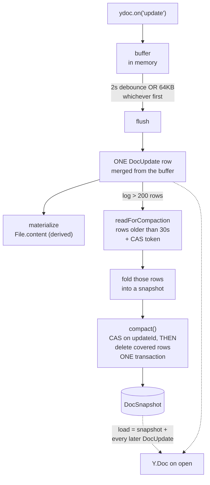

# Architecture

A real-time collaborative code editor: multiple authenticated users edit a shared project
simultaneously with live cursors, edits survive refresh, offline and reconnection, and a
**Run** button executes the code inside a resource-limited, network-isolated Docker
container with output streamed to a browser terminal.

**This document is the map.** It explains what the system is made of and how the pieces fit.
The two core mechanisms have their own documents, because they are genuinely separate:

| For | Read |
|---|---|
| How a keystroke becomes a durable byte on two servers | **[REALTIME.md](REALTIME.md)** |
| How user code runs without ever entering the server process | **[EXECUTION.md](EXECUTION.md)** |
| The data model | **[DATABASE.md](DATABASE.md)** |
| Every endpoint, frame and close code | **[API.md](API.md)** |
| What is protected, what is not, what is tested, where it runs | **[SECURITY.md](SECURITY.md)** |
| Running it | **[SETUP.md](SETUP.md)** |
| *Why* each major choice was made | **[`docs/adr/`](adr/README.md)** — five decisions, with what was rejected |

**Everything here describes what is built.** Where a number appears it is measured, and it says
when it was measured. Verified against source on **2026-09-03**.

---

## 1. What this is

Five workspaces in one npm monorepo, TypeScript 7 throughout, ESM everywhere
(`"type": "module"`, `NodeNext`), built with TS project references (`tsc -b`):

| Workspace | Package | Role |
|---|---|---|
| `apps/web` | `@collab/web` | React client — editor, file tree, presence, terminal, search |
| `apps/server` | `@collab/server` | REST + WebSocket + the collaboration hub. **Never touches Docker** |
| `apps/runner` | `@collab/runner` | BullMQ worker → Docker sandbox. **Never touches HTTP or WebSockets** |
| `packages/shared` | `@collab/shared` | Types shared by all three. Imports from no app; **has no dependencies at all** |
| `loadtest/` | `@collab/loadtest` | Headless Yjs load harness. Imports no app; imported by none |

Three long-running processes (server, runner, Vite in development), plus PostgreSQL 16 and
Redis 7 from `infra/docker-compose.yml`.

The interesting parts are the seams: what Yjs gives versus what had to be built
([REALTIME.md](REALTIME.md) §1), how authorization reaches a WebSocket (§6), how the same
document lives on two server instances without duplicating itself, and how user code runs
without ever entering the server process.

### The stack

| Layer | Choice |
|---|---|
| Language | TypeScript 7, ESM, `strict` + `noUncheckedIndexedAccess` + `verbatimModuleSyntax` |
| Frontend | React 19 + Vite + Tailwind v4, CodeMirror 6, yjs + y-codemirror.next, xterm.js |
| Backend | Node 24 + Express 5, `jose` (JWT), `zod`, `ws` + `y-protocols` + `lib0` |
| Database | PostgreSQL 16 + Prisma 7 (driver adapter) |
| Cache / bus / queue | Redis 7 — BullMQ queue, doc bus, run channels |
| Sandbox | Docker CLI driven from the runner |
| Tests | Vitest + supertest against a real `collab_editor_test` database |

---

## 2. Component map

Source: [`documentation/diagrams/01-system-architecture.mmd`](../documentation/diagrams/01-system-architecture.mmd).

```mermaid
flowchart LR
  subgraph browser["Browser"]
    Web["apps/web — @collab/web<br/>React · Vite · CodeMirror 6<br/>y-indexeddb · xterm.js"]
  end

  Shared["packages/shared — @collab/shared<br/>protocol.ts · languages.ts<br/>zero dependencies"]

  subgraph srv["apps/server — @collab/server, port 4000 — never touches Docker"]
    REST["REST routers<br/>auth · projects · files · execution"]
    WS["/ws collaboration hub<br/>cookie-authenticated upgrade"]
    Rooms["room registry<br/>one Y.Doc + Awareness per open file"]
    Persist["persistence<br/>buffer · DocStore · compactor · materialize"]
    Bus["docBus<br/>lazy publisher + lazy subscriber"]
    Reg["run registry — in memory<br/>one Redis subscriber per run"]
    QProd["BullMQ Queue producer — lazy"]
    SSE["SSE /runs/:jobId/stream"]
  end

  Srv2["apps/server — second instance, port 4001<br/>same code, its own Y.Docs and its own flush cycle"]

  subgraph runner["apps/runner — @collab/runner — sole owner of the Docker socket"]
    Wrk["BullMQ Worker<br/>concurrency 2 · attempts 1"]
    Lim["runWithLimits<br/>10 s wall clock · 1 MB output"]
    Drv["runInContainer<br/>docker create then cp then start -a"]
    Reap["reaper<br/>label ce.run, older than 60 s"]
  end

  PG[("PostgreSQL 16<br/>User · Project · ProjectMember · File<br/>DocUpdate · DocSnapshot")]

  subgraph rds["Redis 7 — three uses, six connection roles, never shared"]
    Queue["BullMQ queue 'exec'"]
    DocCh["Pub/Sub channel doc:projectId:fileId"]
    RunCh["Pub/Sub channel run:jobId"]
  end

  Docker["Docker daemon"]
  Cont["sandbox container<br/>network none · user 1000:1000 · 256 MB · 0.5 CPU<br/>64 pids · read-only rootfs · tmpfs /tmp · volume /work"]

  LT["loadtest — @collab/loadtest<br/>headless Yjs clients, development only"]

  Web -->|"HTTP + ce_session cookie<br/>Vite proxies /api and /ws in dev"| REST
  Web <-->|"binary Yjs frames"| WS
  SSE -->|"text/event-stream"| Web

  WS --- Rooms
  Rooms --- Persist
  Rooms --- Bus
  REST -->|"Prisma — imported only here"| PG
  Persist -->|"DocUpdate rows · DocSnapshot · File.content"| PG

  Bus <-->|"PUBLISH / SUBSCRIBE"| DocCh
  DocCh <--> Srv2
  Srv2 -->|"its own append + flush"| PG

  REST --> QProd
  QProd -->|"queue.add, attempts 1"| Queue
  Queue -->|"job"| Wrk
  Wrk --> Lim --> Drv
  Drv -->|"docker CLI — argv array, never a shell"| Docker
  Docker --> Cont
  Reap -->|"docker rm -fv"| Docker

  Wrk -->|"PUBLISH stdout / stderr / exit"| RunCh
  RunCh -->|"one subscriber per run"| Reg
  Reg --> SSE

  Shared -.->|"compile-time types only"| browser
  Shared -.->|"compile-time types only"| srv
  Shared -.->|"compile-time types only"| runner

  LT -.->|"WebSocket + REST, dev only"| WS
```



**Two edges are missing on purpose, and their absence is the architecture:**

1. **`apps/server` has no edge to Docker, and `apps/runner` has no edge to PostgreSQL.** The two
   never import each other; they communicate only through the BullMQ queue and Redis channels,
   with payload types from `@collab/shared`. Access to the Docker socket is effectively root on
   the host, which is why it lives in a process that serves no HTTP.
2. **User code never executes in the server process** — only inside a container owned by the
   runner.

**Redis is drawn as three boxes because it does three unrelated jobs.** The BullMQ queue, the
document channels and the run channels share a server and nothing else — and **six connection
roles exist that never share a connection**: BullMQ producer (server, lazy), one subscriber per
run (server), BullMQ worker connection (runner, blocked on a pop), run publisher (runner),
doc-bus publisher, doc-bus subscriber.

Supporting rules: Prisma is imported **only** in `apps/server`; every server module exports
through an `index.ts` barrel and cross-module calls go through the barrel; no file over ~300
lines; persistence sits behind a `DocStore` interface so the backing store is swappable in one
folder.

### Server modules

```
src/index.ts             the only file that calls listen()
src/app.ts               buildApp() -> Express app, no listen (supertest drives this)
src/config.ts            env parsed once by zod at import; refuses to boot if wrong
src/db.ts                the only PrismaClient, via @prisma/adapter-pg
src/http/                errors.ts (AppError + envelope), originCheck.ts, params.ts
src/modules/auth/        password, token, authenticate, requireAuth, authorize, routes
src/modules/projects/    schemas, service (rules), routes (thin)
src/modules/files/       paths (pure), schemas, service, routes
src/modules/collab/      wsServer (handshake), room (registry), syncHandler (relay)
src/modules/persistence/ DocStore, postgresDocStore, buffer, compactor, materialize
src/modules/execution/   schemas, queue (lazy), registry, service, stream, routes
src/modules/redis/       docBus (channel per doc, lazy pub + sub, instanceId)
```

`service.ts` holds rules and knows nothing about HTTP; `routes.ts` does parse → guard →
service → response. Every error goes through `AppError` and one middleware, producing one
envelope: `{ error: { code, message } }`. The UI branches on `code`, never on `message`.

Route **mount order matters**: files and execution mount before `projectsRouter`, so `/:id` cannot
shadow `/:projectId/files` or `/:projectId/run`.

### Client structure

```
src/app/                routes, AppLayout (header + portal slot), ProjectHeader,
                        ProjectPage, ShortcutsDialog, ErrorBoundary
src/components/         the six primitives + Dialog + icons, behind index.ts
src/lib/                api.ts (the ONLY fetch), types.ts, formErrors.ts
src/features/auth/      AuthContext, LoginPage, RegisterPage, RequireAuth
src/features/projects/  useProjects, ProjectsPage, MembersPanel, dialogs
src/features/files/     useFileTree, FileTree, TreeNode, dialogs
src/features/editor/    CodeMirror, useOpenFiles, EditorPane, Tabs, language, theme
src/features/collab/    CollabProvider, useCollabDocs, presence, reconnect, Facepile
src/features/terminal/  Terminal (xterm), useRun, RunPanel
src/features/search/    match (pure), useProjectSearch, SearchPalette, Highlight
```

**The editor is uncontrolled, and there is nothing to control it with:** no `content` prop and
no React state holding file text at all. Yjs owns the text; `useOpenFiles` keeps only
`{id, path, name}`. If file text ever reappears in React state, that is a data-loss bug
returning.

**The design system is six primitives and no framework** — `Button`, `Field`, `Alert`,
`EmptyState`, `Badge`, `icons`. No `cva`, no `clsx`, no Radix/shadcn/Headless UI, no icon
package. A spinner is `Button`'s `loading` prop; a status dot is a `Badge` variant.

**Responsive is CSS, never a branch.** One `<aside>` in one position in the tree; below `md` it
leaves the flow and slides by transform. Rendering a different tree per breakpoint would remount
the sidebar — and, drawn any higher, the editor.

---

## 3. How an edit travels

Summarised here; the full path, including the join handshake, persistence and the failure paths,
is in **[REALTIME.md](REALTIME.md)**.

```
Browser A ──edit──▶ Server 1 ──local fan-out first──▶ Browser B (same instance)
                        │
                        └──PUBLISH doc:<docId>──▶ Redis ──▶ Server 2 ──▶ Browser C
```

```
ws://<same origin>/ws?doc=<projectId>:<fileId>     cookie-authenticated
binary frames only:  byte 0 = type varint (0 Sync, 1 Awareness), rest = y-protocols
close codes:  4400 malformed · 4401 unauthenticated · 4403 forbidden (reserved)
              4404 non-member or no such file · 4409 access changed / file deleted
```

**Local fan-out happens first, the Redis publish second** — a local peer's latency must never
depend on Redis. **Two echo guards exist and both are needed**: `instanceId` is checked on
receive, and a frame applied from the bus carries `BUS_ORIGIN`, which the observers refuse to
re-publish. They fail in different directions.

A room is a `Y.Doc`, an `Awareness`, and a set of connections. `conns.size` *is* the reference
count; the room is destroyed exactly when it reaches zero. `rooms` is a
`Map<docId, Promise<Room>>` with the promise inserted **synchronously**, because two sockets
racing a cold document would otherwise seed it twice — which a user reads as the file's text
appearing twice.

Awareness state goes in the `user` field. A flat `{name, color}` renders every remote caret as
"Anonymous" in the default blue.

→ [ADR-001](adr/ADR-001-yjs-transport.md) · [ADR-003](adr/ADR-003-multi-instance-pubsub.md)

---

## 4. How an edit is stored



Forced flushes happen on the last disconnect, on shutdown, and before every code run. The
constants are real and small: `FLUSH_DELAY_MS = 2_000`, `FLUSH_BYTES = 64 * 1024`,
`COMPACT_AFTER = 200`, `COMPACT_LAG_MS = 30_000`.

**Yjs binary updates are persisted, never plain text.** Rebuilding a `Y.Doc` from a string gives
its items new client ids, so restored peers merge as duplicates rather than converging.

**`File.content` is derived state with exactly one writer**, on the flush tick *after* the append
succeeds. It may lag the log by one flush interval and must never lead it. This is what lets the
runner and the file API read plain text without loading a CRDT — and it is why **there is no
`PUT` for file content**.

**Compaction reads the log, never the live `Y.Doc`**, folds only rows older than 30 s, and writes
behind a compare-and-set on `DocSnapshot.updateId` with the delete running only after the CAS
wins. **Safe pruning, stated once:** every row at or below `DocSnapshot.updateId` is folded into
the snapshot and deleted; every row above it survives and is replayed by `load`. There is no
third case.

**A hard kill costs at most ~2 seconds of typing** — the debounce, and a deliberate trade against
a database write per keystroke.

Full reasoning: [REALTIME.md](REALTIME.md) §7 · [DATABASE.md](DATABASE.md) §5 ·
[ADR-002](adr/ADR-002-persistence-op-log.md) · `docs/notes/compaction.md`

---

## 5. How code runs

```
click Run ─▶ POST /run (EDITOR) ─▶ flush rooms, read File.content, cap 1 MB / 100 files
          ─▶ SUBSCRIBE run:<jobId>  ─▶ queue.add(attempts 1) ─▶ 202 { jobId }
          ─▶ GET /runs/:jobId/stream (SSE, re-authorized)
runner    ─▶ BullMQ Worker, concurrency 2 ─▶ runWithLimits ─▶ runInContainer
          ─▶ PUBLISH run:<jobId>  { stdout | stderr | exit }
```

**Run output is SSE, never the collaboration socket.** That socket is per-document; a run is
per-project. `MessageType`, `CollabProvider.ts` and `reconnect.ts` are untouched by the execution
feature and must stay that way.

The sandbox is one function, `runInContainer`, in one file:

```
--rm --pull never --network none --memory 256m --memory-swap 256m --cpus 0.5
--pids-limit 64 --read-only --tmpfs /tmp:rw,size=32m
--mount type=volume,dst=/work      <- /work MUST be a volume
--ulimit fsize=33554432            <- 32 MiB per FILE, not per workspace
--cap-drop ALL --security-opt no-new-privileges --user 1000:1000 -w /work
```

**The server subscribes before it enqueues**, because Pub/Sub is at-most-once and a fast program
finishes in ~300 ms. **Exactly one `exit` frame ends every run, on every path.** **A run is
bounded, so nothing about it retries** — `attempts: 1`, and the client never reconnects a stream.

Adding a language is one config entry in `packages/shared/src/languages.ts` — zero code changes.
Two exist: `collab-sandbox-python:1` and `collab-sandbox-node:1`.

Full detail, limits, lifecycle and failure paths: **[EXECUTION.md](EXECUTION.md)** ·
[ADR-004](adr/ADR-004-execution-queue-worker.md) · [ADR-005](adr/ADR-005-files-into-container.md)

---

## 6. Authentication and authorization

**Sessions.** Register/login with scrypt-hashed passwords (`node:crypto`), a JWT signed with
`jose`, delivered as an `httpOnly; SameSite=Strict` cookie with a 7-day lifetime.

**The cookie authenticates the WebSocket upgrade — never a `?token=`.** A token in a URL lands in
proxy logs, browser history and `Referer` headers. Since `originCheck` guards only mutating HTTP
methods and an upgrade is a GET, `wsServer.ts` checks `Origin` itself.

**Every WebSocket rejection is an application close code, not a pre-upgrade HTTP 401** — a
browser cannot read that status; `onclose` gives 1006 with no reason.

**Authorization is enforced server-side and never trusted from the client.**
`assertProjectAccess(userId, projectId, minRole)` is shared by both the REST and WebSocket paths.
Roles are `OWNER` > `EDITOR` > `VIEWER`, ranked in TypeScript rather than in SQL.

**404 vs 403 is a deliberate distinction:** not a member → **404**, so project existence stays
private. **403** means "you are a member, but not senior enough". This must not be changed to a
403.

**Authorization runs once, at join** — before the socket is attached to a room. That is safe only
because a role change, a removal, a project delete and a file delete all close the affected
sockets with **4409**. There is no per-message check and no timer.

Role gating in the UI is **cosmetic**; the server enforces. A UI that hides and a server that
enforces is the right pair.

### The dev proxy is part of the security model

The session cookie is `SameSite=Strict`, and Vite (`:5173`) and the API (`:4000`) are different
origins — so without a proxy the cookie is never sent, login appears to succeed, and every later
request 401s. `vite.config.ts` proxies `/api` and `/ws` (`ws: true`, which forwards the HTTP
upgrade rather than answering it). The browser then sees one origin, so `Origin` stays
`http://localhost:5173` and passes `originCheck`. **Do not add `changeOrigin: true`.**

Weaknesses — including that a **missing `Origin` header is allowed through**, that **sessions
cannot be revoked**, and that **revocation does not cross instances** — are documented in
**[SECURITY.md](SECURITY.md)**.

---

## 7. Search

Client-only, and worth naming because it looks like a backend feature and is not.

```
names    = the tree the sidebar already loaded — synchronous, every keystroke
contents = GET /projects/:id/files/:fileId per file: 220 ms debounce, 6 at a time,
           ≤300 files, ≤5 matches/file, ≤120 total, cached by `${id}@${updatedAt}`
keys     = Ctrl/Cmd+K all · Ctrl/Cmd+P names · Ctrl/Cmd+Shift+F contents ·
           Ctrl/Cmd+B sidebar · ? shortcuts
```

**There is no search backend and no index.** `apps/server`, `apps/runner`, `packages/**` and
`loadtest/**` contain nothing for it. Content search reuses the file-content route that module
4.4 already materializes, which means **it sees `File.content` and therefore lags the live
document by up to a flush** — the same freshness contract as the Run button. A project larger
than 300 files is searched **partially**, and the palette says so rather than silently returning
fewer results.

`match.ts` is pure and is the single definition of "what counts as a match"; `matchContent` is a
**literal** search, never a regex, because a half-typed regex throws on most keystrokes.

---

## 8. What Yjs does vs what this project built

The honest division of labour. **This project did not implement a CRDT.**

| Yjs and its ecosystem provide | This project built |
|---|---|
| CRDT merge (YATA), client ids and clocks, state vectors, tombstones | The **transport**: `/ws`, the handshake, binary framing, the close-code vocabulary |
| The `y-protocols` sync and awareness message formats | **Cookie authentication on the upgrade**, and the `Origin` check an upgrade would otherwise skip |
| `y-codemirror.next` — the editor binding and remote carets | **Per-document authorization** and **live revocation** (4409 on role change, removal, delete) |
| `y-indexeddb` — the local document store | The **room registry**: one `Y.Doc` per open file, refcounted, race-safe on cold open |
| Conflict-free convergence of concurrent edits | **Persistence**: append-only op log, snapshots, compaction, behind a swappable `DocStore` |
| Gap repair on the next sync round-trip | **`File.content` materialization** — derived text with one writer, so the runner never loads a CRDT |
| | **Cross-instance fan-out** with two echo guards and per-document channels |
| | The **reconnect/offline state machine**: `ready` vs `status`, jittered backoff, terminal codes |
| | The **sandboxed runner** and the entire execution path |
| | The **measurement harness**, and the numbers in §9 |

Put shortly: **Yjs guarantees that concurrent edits converge. It guarantees nothing about who is
allowed to edit, where the bytes live, what happens when the process dies, or how a second server
instance learns anything.**

---

## 9. Measured performance

Every number here was measured on **2026-08-15** by the harness in `loadtest/`, against the built
server. Full method, environment and caveats:
**[`docs/notes/loadtest-results.md`](notes/loadtest-results.md)**, with 19 raw result blobs in
`loadtest/results/`. **No estimate appears in this section, and none of it was re-measured for
this document.**

| Scenario (25 clients, 2 runs each) | p50 | p95 | p99 | n | Note |
|---|---|---|---|---|---|
| **R1** distributed, 10 docs, 1 instance | 2.0 ms | 5.0 ms | 8–11 ms | 825 | baseline |
| **R2** hot doc, 1 instance | 5.0 ms | 10–11 ms | 13 ms | 1320 | R2 − R1 = hot-doc contention; fan-out is O(clients) per room |
| **R3** hot doc, 2 instances | 5–6 ms | 11–13 ms | 15–18 ms | 1320 | R3 − R2 = doc-bus overhead |
| **R4x** distributed, 9 docs, 2 instances | 2–3 ms | 8.0 ms | 12–14 ms | 880 | **2.0× `DocUpdate` rows** — write amplification, not corruption |
| **Ceiling** hot doc, 100 clients | — | — | 2083 ms | — | **fail — but the harness was at 402% of a 400% CPU budget while server CPU peaked at 32% of one core.** The limit measured is the load generator's |

All runs converged: every client on a document ended with byte-identical text of exactly the
expected length.

**Two figures that shape the design:** the 2 s flush debounce shows up as **~30 `DocUpdate` rows
per document per minute per instance**, and two instances cost **~2× RSS** (≈178 MB → ≈360 MB
combined) for the same work.

**What was not measured:** the Run path (never load-tested), the server's real capacity ceiling,
cross-instance revocation, REST throughput, any client count above 200, real network latency, and
anything browser-side. All localhost, all 60-second runs, all on one 4-core WSL2 VM hosting
everything at once.

**Compaction was measured later.** Phase 8 never reached it — the threshold was never approached
in 60 seconds. A 300-second two-instance run in Phase 11 did: `snapshots Δ1`, `high-water Δ3539`,
with the lowest surviving row id exactly one above the watermark and a cold rebuild identical to
`File.content`. Compaction's own latency and CPU cost, and log length over a long-lived document,
are still unmeasured (`docs/notes/compaction.md`).

### Re-verified on 2026-09-03

| | |
|---|---|
| Server test suite | **245 tests in 13 files, all passing, 46.80 s** against a real database |
| Client production build | Succeeds in 1.04 s. **Initial JS 315.56 kB (98.49 kB gzipped)**; lazy `ProjectPage` chunk 923.14 kB (283.92 kB gzipped); CSS 27.40 kB + 3.93 kB |
| Infrastructure | `collab-postgres` and `collab-redis` both healthy |

`ProjectPage` is a `React.lazy` route, so CodeMirror, Yjs and xterm load only when a project is
opened. **Watch the initial number when adding an import to an eager file** — importing one
helper from the collab barrel once pulled Yjs onto the eager path and moved it from 308.86 kB to
407.23 kB.

---

## 10. Known limitations

Stated plainly, because a limitation you can name is worth more than one you have hidden. **The
full, evidenced list is in [SECURITY.md](SECURITY.md) Part 6.** The ones that shape how you
should read the rest of this document:

- **The sandbox is a reasonable local sandbox, not production-grade isolation.** Shared kernel,
  Docker's default seccomp only, no user namespaces, no gVisor. A kernel exploit escapes it.
- **`/work` has no total size cap** — 32 MiB per *file*, with the total bounded only by the
  10-second timeout.
- **No rate limiting anywhere**, including login and `/ws`.
- **Sessions cannot be revoked before their 7-day expiry**, and **revocation does not cross
  server instances**.
- **Runs do not cross instances** — a browser must reach the instance that took its POST.
  Collaboration tolerates at-most-once because Yjs self-heals; run output does not.
- **Capacity is unmeasured**, because the load generator saturates this machine before the server
  does.
- **No frontend tests, no runner tests, no linter and no CI.** All 245 tests are `apps/server`
  tests — the part that executes untrusted code has none.
- **Never deployed, and there is no deployment configuration** — the only Dockerfiles in the
  repository are the two sandbox images for user code.

---

## 11. Where to go next

| For | Read |
|---|---|
| **Why** each major choice was made | [`docs/adr/`](adr/README.md) — five decisions, with what was rejected |
| Real-time collaboration in full | [REALTIME.md](REALTIME.md) |
| Code execution and the sandbox in full | [EXECUTION.md](EXECUTION.md) |
| The data model | [DATABASE.md](DATABASE.md) |
| Endpoints, frames, close codes | [API.md](API.md) |
| Security, testing and deployment status | [SECURITY.md](SECURITY.md) |
| Running it | [SETUP.md](SETUP.md) · [`README.md`](../README.md) |
| The measured numbers, in full | [`docs/notes/loadtest-results.md`](notes/loadtest-results.md) |
| How the sandbox actually works | [`docs/notes/sandbox.md`](notes/sandbox.md) · [`sandbox-tests.md`](notes/sandbox-tests.md) |
| CRDT intuition | [`docs/notes/yjs.md`](notes/yjs.md) |
| Multi-instance behaviour and browser results | [`docs/notes/scaling.md`](notes/scaling.md) |
| Op log vs snapshot trade-offs | [`docs/notes/persistence.md`](notes/persistence.md) · [`compaction.md`](notes/compaction.md) |
| Diagram sources | [`documentation/diagrams/`](../documentation/diagrams/) |
