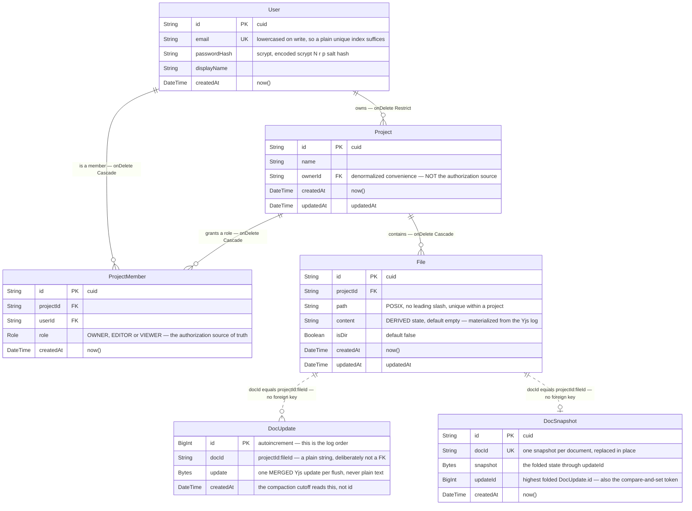

# Database

PostgreSQL 16, accessed through Prisma 7. **Six tables and one enum** — the whole schema fits
on one screen, and this document explains every field, constraint and index in it.

**Source of truth:** [`apps/server/prisma/schema.prisma`](../apps/server/prisma/schema.prisma).
Two migrations: `20260808203715_init` and `20260809100854_phase1_models`. Everything below was
read out of that schema; nothing is inferred.

**Prisma is imported only in `apps/server`.** `apps/runner` never touches the database — it
receives plain text in its job payload. `apps/web` never touches it at all.

---

## 1. Overview

| Table | Holds | Written by |
|---|---|---|
| `User` | Accounts and password hashes | `modules/auth` |
| `Project` | Projects | `modules/projects` |
| `ProjectMember` | Who may do what, per project | `modules/projects` |
| `File` | The file tree, plus a plain-text projection of each file | `modules/files`, and `File.content` by `modules/persistence` |
| `DocUpdate` | The append-only log of Yjs binary updates | `modules/persistence` |
| `DocSnapshot` | One folded snapshot per document | `modules/persistence` |

Plus `enum Role { OWNER, EDITOR, VIEWER }`.

**What is deliberately *not* in the database:**

- **No session table.** Sessions are stateless JWTs in a cookie. This is why a session cannot
  be revoked before it expires — see [SECURITY.md](SECURITY.md).
- **No job or run table.** Queued runs live in Redis (BullMQ), and in-flight run state lives in
  memory on one server instance.
- **No global role column on `User`.** Every permission in this system is per-project and lives
  on `ProjectMember`.

---

## 2. ER diagram

Source: [`documentation/diagrams/02-er-database.mmd`](../documentation/diagrams/02-er-database.mmd).



The two **dashed** relations are the important detail: `DocUpdate` and `DocSnapshot` have **no
foreign key** to `File`. See §5.

---

## 3. Identity and access

### `User`

| Field | Type | Notes |
|---|---|---|
| `id` | `String` PK | cuid |
| `email` | `String` **unique** | Normalized — trimmed and lowercased by `emailSchema` **before** it reaches the database. That normalization plus a plain unique index is what stops `Alice@x.com` and `alice@x.com` becoming two accounts, with no `citext` extension needed |
| `passwordHash` | `String` | `scrypt$N$r$p$<salt-b64>$<hash-b64>`. Parameters live *inside* the string, so raising the cost later does not invalidate existing hashes |
| `displayName` | `String` | ≤ 80 characters |
| `createdAt` | `DateTime` | `now()` |

There is **no role field**. Deleting a user cascades to their memberships but is *restricted*
by any project they own (§4).

### `Project`

| Field | Type | Notes |
|---|---|---|
| `id` | `String` PK | cuid |
| `name` | `String` | 1–100 characters after trimming |
| `ownerId` | `String` FK → `User.id` | **A denormalized convenience for listings only.** `assertProjectAccess` never reads it |
| `createdAt` / `updatedAt` | `DateTime` | |

> **The authorization source of truth is the `OWNER` row in `ProjectMember`, not
> `Project.ownerId`.** These are two different things that usually agree. Any code that
> authorizes off `ownerId` is wrong.

Creating a project writes the row **and** its `OWNER` membership in one nested Prisma create,
which is a single transaction. That matters: a project without its `OWNER` row is a project
nobody can open, including the person who just made it.

### `ProjectMember`

| Field | Type | Notes |
|---|---|---|
| `id` | `String` PK | cuid |
| `projectId` | `String` FK → `Project.id` | Cascade |
| `userId` | `String` FK → `User.id` | Cascade |
| `role` | `Role` | `OWNER` \| `EDITOR` \| `VIEWER` |
| `createdAt` | `DateTime` | |

**Constraints:** `@@unique([projectId, userId])` — one membership per user per project, and the
index `assertProjectAccess` reads on every REST request *and* every WebSocket join.
`@@index([userId])` serves "list my projects".

**Privilege ordering is not in SQL.** It lives in `ROLE_RANK` in
`apps/server/src/modules/auth/authorize.ts`, typed as `Record<Role, number>` so adding a role
to the enum fails to compile until it is ranked.

Two rules are enforced in the service layer, not by constraints: a project must always have at
least one `OWNER` (`409 LAST_OWNER`), and you cannot remove yourself (`409 CANNOT_REMOVE_SELF`).

---

## 4. Files

### `File`

| Field | Type | Notes |
|---|---|---|
| `id` | `String` PK | cuid |
| `projectId` | `String` FK → `Project.id` | Cascade |
| `path` | `String` | Full POSIX path from the project root, **no leading slash** (`src/main.py`) |
| `content` | `String` | Default `""`. **Derived state** — see §6 |
| `isDir` | `Boolean` | Default `false` |
| `createdAt` / `updatedAt` | `DateTime` | `updatedAt` is what the client's search cache keys on |

**Constraint:** `@@unique([projectId, path])` — the single collision guard for the whole file
module. Directories are rows too, so a directory and a file cannot share a path.

**There is no parent-id column.** The tree is derived from the path string by `buildTree()`,
which means a rename is a prefix rewrite across the project's rows rather than a pointer
update.

**Path rules** (`modules/files/paths.ts`, enforced identically for every caller — all
`400 INVALID_PATH`): at most 1024 characters, 255 per segment, 32 levels deep; no leading or
trailing whitespace; no control characters (`U+0000`–`U+001F`, `U+007F`); no backslashes; no
leading or trailing `/`; no empty segments; no `.` or `..` segments. **Invalid paths are
rejected, never silently rewritten** — quietly normalizing `a/./b` to `a/b` would leave the
client believing it created something it did not.

---

## 5. Yjs persistence

These two tables store document *bytes*. They are the subject of
[REALTIME.md](REALTIME.md) §5; this section covers only their shape.

### The `docId` convention — and why there is no foreign key

Both tables key on `docId`, a plain string equal to `` `${projectId}:${fileId}` `` (built by
`makeDocId` in `@collab/shared`). A cuid contains no colon, so the separator is unambiguous.

This is deliberate: the `DocStore` interface treats `docId` as an **opaque string** and never
parses it, which is what keeps the backing store swappable behind one line
(`docStore` in `modules/persistence/index.ts`). A foreign key would tie the storage layer to
this specific schema.

**The cost, stated honestly:** deleting a file cannot cascade to its document rows, so the
services delete them explicitly (`docStore.deleteDoc(makeDocId(...))`). Room teardown is
asynchronous, so a final flush can land *just after* a delete and leave **orphan rows**. They
are unreachable — `createRoom` returns null when the `File` row is gone, so `load` is never
called for them — and bounded by "a socket was open at deletion time". They are never cleaned
up. Fixing this means making revocation awaitable.

### `DocUpdate` — the append-only log

| Field | Type | Notes |
|---|---|---|
| `id` | `BigInt` PK `autoincrement` | **`BigInt` on purpose.** This log grows per flush and would overflow `Int` on a busy document; changing a primary key type after data exists is genuinely painful. The id *is* the log order |
| `docId` | `String` | Not a FK, see above |
| `update` | `Bytes` | **One merged Yjs update per flush**, not one per keystroke |
| `createdAt` | `DateTime` | Read by compaction's cutoff — see below |

**Index:** `@@index([docId, id])`. This is exactly the load path: find the snapshot, then scan
`docId = ? AND id > watermark` in ascending order.

> **Why compaction reads `createdAt` and not `id`:** a sequence value is allocated *before* its
> transaction commits, so a row with a *lower* id can become visible after a compaction has
> already read past it. Such a row survives the delete and is then hidden forever by `load`'s
> `id > updateId` filter. The 30-second `createdAt` cutoff is what makes that unreachable. It
> is a margin, not a proof.

### `DocSnapshot` — one per document

| Field | Type | Notes |
|---|---|---|
| `id` | `String` PK | cuid |
| `docId` | `String` **unique** | One snapshot per document, replaced in place — snapshots never accumulate |
| `snapshot` | `Bytes` | The folded state through `updateId` |
| `updateId` | `BigInt` | Highest `DocUpdate.id` folded in. `0n` for a seed snapshot that folds nothing |
| `createdAt` | `DateTime` | |

`updateId` does **two** jobs: it is the watermark `load` filters on, and it is the
**compare-and-set token** that makes compaction safe when two server instances write the same
log. The `@unique` on `docId` is itself part of that CAS — a racer that creates a snapshot
where the read saw none makes the transaction fail with P2002 and roll back.

**Safe pruning, the whole rule:** every row at or below `DocSnapshot.updateId` is folded into
the snapshot and deleted; every row above it survives and is replayed by `load`. There is no
third case.

### Prisma's `Bytes` is asymmetric

Reads produce `Uint8Array<ArrayBuffer>`; writes demand it; Yjs produces
`Uint8Array<ArrayBufferLike>`. `postgresDocStore.ts` has a `toStoredBytes` helper that copies
into an `ArrayBuffer`-backed view. Never call `.buffer` or `.byteOffset` on bytes that came out
of the store.

---

## 6. `File.content` is derived state

`File.content` is a **plain-text projection of the update log**, not the document.

- **Exactly one writer:** `materializeContent()` in `modules/persistence/materialize.ts`.
- **Written on the flush tick, *after* the append that produced it has succeeded.** It may lag
  the log by one flush interval (~2 s) and must never lead it.
- A failed materialization is **logged and dropped** — never rolled back, never requeued. The
  log already holds the truth and the next flush recomputes the whole text.
- **Compaction never writes it.**
- It uses `updateMany`, not `update`, so a file deleted while it was open affects zero rows
  instead of throwing P2025.

Two consequences that surface elsewhere:

1. **There is no `PUT` for file content.** A REST write would be silently overwritten by the
   next flush. See [API.md](API.md).
2. **Anything that reads `File.content` sees a value up to one flush old** — the Run button
   (which forces a flush first) and project search (which does not). See
   [EXECUTION.md](EXECUTION.md) and [SECURITY.md](SECURITY.md).

---

## 7. Deletion behaviour

| Deleting | Effect |
|---|---|
| `User` | **`onDelete: Restrict`** on `Project.owner` — a user who owns any project cannot be deleted. Their `ProjectMember` rows would cascade. Deliberate: deleting a user must not silently destroy projects their collaborators are still working in |
| `Project` | Cascades to `ProjectMember` and `File`. The service also closes every socket in the project (4409) and calls `docStore.deleteDoc` for each file |
| `ProjectMember` | Nothing cascades. The service closes that user's sockets in that project (4409) |
| `File` (or a directory) | Cascade does not reach `DocUpdate`/`DocSnapshot`; the service deletes descendants, closes their rooms (4409) and calls `docStore.deleteDoc` for each. Orphan rows remain possible — §5 |

**There is no soft delete and no audit trail anywhere.**

---

## 8. Connection and migrations

The `datasource` block declares **no URL**. Prisma 7 supplies it two different ways:
`prisma.config.ts` for `migrate`/`introspect`, and a driver adapter (`@prisma/adapter-pg`) to
`PrismaClient` at runtime in `apps/server/src/db.ts`, which is the only `PrismaClient` in the
codebase.

**An explicitly-set `DATABASE_URL` always beats `apps/server/.env`.** Both `config.ts` and
`prisma.config.ts` follow that rule — it is what lets the test harness point at
`collab_editor_test` instead of wiping development data. It is also a trap: exporting
`DATABASE_URL` in a shell suppresses the whole `.env` load, and the server then dies on a
missing `JWT_SECRET`. See [SETUP.md](SETUP.md).

Applying migrations:

```bash
cd apps/server && npx prisma generate && npx prisma migrate deploy
```

`generate` is **not** optional on a fresh clone — npm's `allow-scripts` gate leaves Prisma's
postinstall unapproved, so `@prisma/client` exports nothing and the build fails.

---

## 9. Verification

Everything in this document was read from `schema.prisma` and the module sources on
**2026-09-03**. The schema is exercised by the server test suite — **245 tests in 13 files, all
passing** against a real `collab_editor_test` database on that date — of which `docStore.test.ts`
(21), `compaction.test.ts` (3), `files.test.ts` (29), `projects.test.ts` (24) and
`authorize.test.ts` (14) touch these tables most directly.

**Not measured:** table sizes, index effectiveness, query plans, and log length over a
long-lived document. No `EXPLAIN` has ever been run against this schema.
