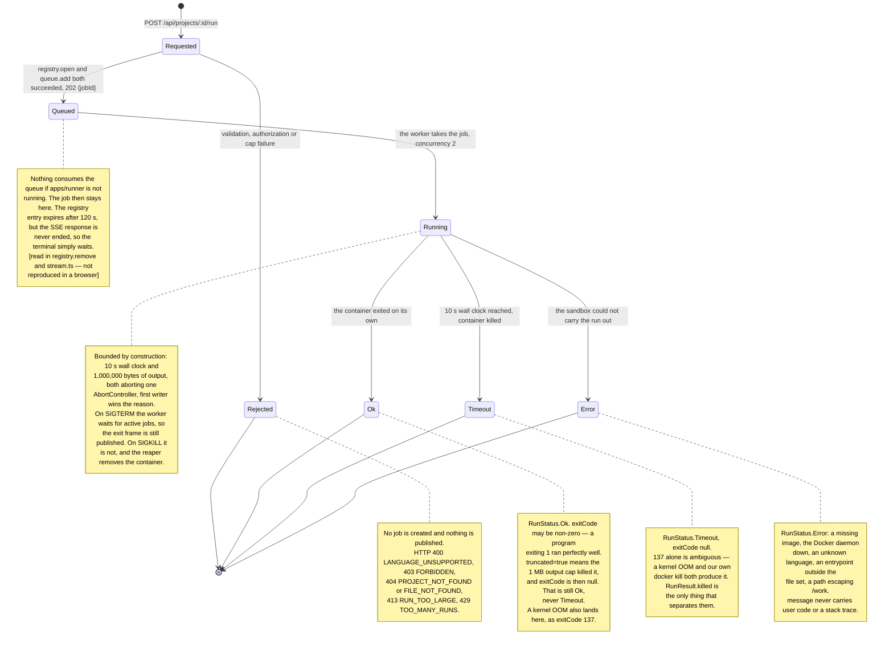

# Code execution & sandbox

Click **Run** and the project executes inside a resource-limited, network-isolated Docker
container, with stdout and stderr streaming into a browser terminal as they are produced.

**Read the honest framing first:** this is a *reasonable local sandbox, not production-grade
isolation*. The kernel is shared with the host, only Docker's default seccomp profile applies,
and there is no user-namespace remapping and no gVisor. **A kernel exploit escapes it.** Nothing
in this document claims more than that.

**Source of truth:** `apps/server/src/modules/execution/*`, `apps/runner/src/*`,
`packages/shared/src/languages.ts`, `infra/images/*`, `apps/web/src/features/terminal/*`. Read
on **2026-09-03**.

---

## 1. The boundary that defines this feature

```
apps/server  →  BullMQ queue + Redis channels  →  apps/runner  →  Docker
```

- **`apps/runner` is the sole owner of the Docker socket.** `apps/server` imports no Docker
  anything and nothing from `apps/runner`; the runner imports no Prisma, no Yjs, no Express and
  no `ws`. Its entire dependency list is `@collab/shared`, `bullmq`, `ioredis`.
- **User code never executes in the server process.**
- Access to the Docker socket is effectively root on the host. That is *why* it lives in a
  process that serves no HTTP or WebSocket traffic ([ADR-004](adr/ADR-004-execution-queue-worker.md)).
- **`runInContainer` is the entire sandbox interface** — one function, one file. A container
  pool, a different runtime or a remote executor would replace exactly it.

---

## 2. Submission

`POST /api/projects/:projectId/run` with `{ "entrypoint": "src/main.py" }`, **EDITOR required**
— running code is not reading it. Full request/response contract in [API.md](API.md) §7.

The order of operations is not arbitrary:

1. **Authorize** — `requireAuth`, then `requireProjectRole('EDITOR')`.
2. **Resolve the language from the file extension.** The client never sends a language; a client
   that could pair arbitrary code with an arbitrary container image would be a hole. No match →
   `400 LANGUAGE_UNSUPPORTED`.
3. **`flushAllRooms()`.** `File.content` is derived state that lags the update log by up to one
   flush (~2 s). Running the version from two seconds ago would be the most confusing bug this
   feature could ship.
4. **Read the project** — `listFilesForRun` returns every non-directory file as plain text, in
   one query. Directories are excluded; `docker cp` recreates the tree from the paths.
5. **Check the entrypoint is in that set** → `404 FILE_NOT_FOUND`.
6. **Cap the payload** — at most **100 files** and **1,000,000 bytes** total (bytes, not
   characters) → `413 RUN_TOO_LARGE`. This bounds what sits in Redis until the runner takes it.
7. **`registry.open()` — SUBSCRIBE before enqueue.** See §6. Also enforces the **20 active
   runs** cap → `429 TOO_MANY_RUNS`.
8. **Enqueue**, then return `202 { jobId }`. A failed enqueue releases the subscription and its
   slot before the error propagates.

> **Freshness contract:** a run includes everything the *server* has. Edits made while a
> client's collaboration socket was down have not reached the server, and `flushAllRooms()`
> cannot conjure them. **A run does not include unsynced edits.**

---

## 3. The queue

BullMQ on Redis, queue name **`exec`**, defined once in `@collab/shared` so the two processes
cannot disagree by typo.

```ts
queue.add('run', job, { attempts: 1, removeOnComplete: true, removeOnFail: true })
```

- **`attempts: 1`.** A run is bounded, so **nothing about it retries** — re-running code that
  failed is the user's decision, made by pressing Run again. This is what stops a second retry
  system appearing beside the collaboration reconnect logic.
- **`removeOnComplete` / `removeOnFail`.** Each payload carries a whole project, and nothing
  reads finished job state.
- **The producer is a lazy singleton.** A `new Queue()` at import time would open ioredis
  connections inside every test that calls `buildApp()`, giving the suite a hard Redis
  dependency it has never had. Importing the module connects to nothing; only a real `POST /run`
  does.
- **There is deliberately no BullMQ `Worker` in `apps/server`** — instantiating one would put
  user code a single import away from the API process.

The job body is JSON-serializable and nothing more:

```ts
RunJob = { jobId, projectId, languageId, entrypoint, files: [{ path, content }] }
```

`projectId` is carried for worker logs and for reading a stuck queue; the runner queries nothing
with it.

---

## 4. The worker

`apps/runner` — a BullMQ `Worker` on `exec` with **concurrency 2**. Two containers at most, each
capped at 256 MB and 0.5 CPU. This plus the 20-entry registry cap is the **only backpressure in
the system**.

The handler is deliberately thin: `limits.ts` has already decided what a timeout is, what
truncation is and what a sandbox failure is, so `LimitedRunResult` maps field-for-field onto the
`exit` frame. The worker translates and never interprets.

**The worker never throws for an execution result**, including `status: 'error'`. The terminal
frame is the single execution-result channel: a client learns what happened from the frame and
from nowhere else. Throwing would mark the BullMQ job failed, which nothing reads — no
dead-letter queue, no job-state subscriber, and with `attempts: 1` no retry — so it would be a
failure signal with no receiver. **Every job therefore completes from BullMQ's point of view,
including runs that failed.**

**Two Redis connections, and it is a Redis constraint rather than a preference:** BullMQ takes
ownership of the connection it is given and *blocks* on it waiting for jobs, so a publish
sharing that connection would wait behind the blocking pop.

---

## 5. The Docker sandbox

### Getting the files in

`docker create` → `docker cp` → `docker start -a`, with `/work` as a **plain anonymous volume**.
Never a bind mount ([ADR-005](adr/ADR-005-files-into-container.md)).

Files are written to a host temp directory first and copied in **one** invocation
(`docker cp <dir>/. <cid>:/work`), which creates the intermediate directories inside the
container — something a per-file copy could not do. Paths were validated upstream by
`files/paths.ts`; `stageFiles` re-checks with a `path.resolve` prefix test as defence in depth.

> **`/work` must be a volume — three outcomes, and two of them fail differently.** With a
> read-only rootfs, `docker cp` is **refused outright**. `--tmpfs /work` is **refused the same
> way** (and would shadow the copy anyway). A **tmpfs-backed *named volume* is worse still: the
> copy reports success and the data is silently gone at start**, because the tmpfs is
> materialised at container start and shadows what was copied. Verified in module 6.2. Never
> reintroduce either.

### The flags, exactly as passed

```
docker create --rm --pull never --name ce-run-<id> --label ce.run=<id>
  --network none
  --memory 256m --memory-swap 256m
  --cpus 0.5
  --pids-limit 64
  --read-only
  --tmpfs /tmp:rw,size=32m
  --mount type=volume,dst=/work
  --cap-drop ALL
  --security-opt no-new-privileges
  --ulimit fsize=33554432
  --user 1000:1000
  -w /work  <image>  <cmd…>  <entrypoint>
```

| Flag | Job |
|---|---|
| `--rm` | Removes the container on exit, **and its anonymous volume with it** |
| `--pull never` | Never contacts a registry. A missing image fails instantly and locally |
| `--network none` | No outbound connection of any kind |
| `--memory` = `--memory-swap` | No swap: a large allocation is OOM-killed rather than paged out |
| `--cpus 0.5` | A busy loop cannot starve the host |
| `--pids-limit 64` | Fork bombs |
| `--read-only` | Nothing on the root filesystem is writable |
| `--tmpfs /tmp:rw,size=32m` | Bounded scratch, and the image's `HOME` |
| `--mount type=volume,dst=/work` | The workspace — see above |
| `--cap-drop ALL` | Every Linux capability |
| `--security-opt no-new-privileges` | No setuid escalation |
| `--ulimit fsize=33554432` | **32 MiB per FILE** — not per workspace |
| `--user 1000:1000` | Never root inside the container |

**Every invocation is an argv array, never a shell string. There is no `shell: true` anywhere in
`apps/runner`.** File names come from a database, and a shell would make that an injection
surface.

`docker start -a` attaches **without stdin** (`-i` is absent), so a program calling `input()`
reads EOF instead of hanging forever, and **without a TTY**, so stdout and stderr arrive on
separate pipes and stay distinguishable. A `StringDecoder` per stream keeps a multi-byte
character split across two chunks from being corrupted.

### The images

Two, built locally by `infra/images/build.sh` and pinned to a major tag — never `:latest`:

| Image | Base | Runs |
|---|---|---|
| `collab-sandbox-python:1` | `python:3.13-slim` | `.py` via `python -u` |
| `collab-sandbox-node:1` | `node:24-slim` | `.js`, `.mjs`, `.cjs` via `node` |

Both **install nothing** — a program gets the standard library and no third-party packages.
Both create or reuse uid/gid **1000**, own `/work`, set `HOME=/tmp` (the rootfs is read-only at
runtime), clear `ENTRYPOINT`, and declare **no `CMD`** so the runner always supplies an explicit
argv. Python also sets `PYTHONDONTWRITEBYTECODE=1`.

`python -u` is not cosmetic: Python buffers stdout to a pipe, so without it a program printing
for eight seconds delivers everything at exit and the streaming terminal streams nothing. Node
line-buffers already.

**The image is only half of the sandbox** — isolation, limits and capability dropping are
runtime flags, not properties of a Dockerfile.

---

## 6. Result delivery

Run output is **Server-Sent Events, never the collaboration WebSocket.** That socket is
per-*document*; a run is per-*project*, so it has no principled answer to "which file's
connection carries this" or "what if nothing is open". SSE is same-origin through the existing
`/api` proxy so it inherits the session cookie, it is one-way like a display-only terminal, and
it ends with the run instead of living as long as the tab.

### Why the server subscribes before it enqueues

Redis Pub/Sub is **at-most-once**. A small program finishes in roughly 300 ms — the same order as
the POST/SSE round trip. A subscription opened when the stream request arrived would routinely
lose a run's entire output *and* its terminal frame, leaving a terminal that streams nothing
forever. So `SUBSCRIBE` is awaited before `queue.add`, and anything published before a client
attaches is **buffered and replayed in order** on attach.

The registry also keeps a **terminal entry alive until a client has drained it**. Deleting on
the terminal frame threw away exactly the output a late subscriber came for — that was a real
bug found in module 6.6.

### The frames

```ts
{ type: 'stdout' | 'stderr', data: string }
{ type: 'exit', status, exitCode, durationMs, truncated, message? }
```

**Exactly one `exit` frame ends every run, on every path**, published from a `finally` behind a
`terminalSent` guard, with three call sites. Without it the browser spins forever. The server
calls `res.end()` on it, and the client then closes its `EventSource` — suppressing
`EventSource`'s own auto-reconnect, which would otherwise reopen the stream after every finished
run, 404 against a deleted registry entry, and loop.

### The full path

Source: [`documentation/diagrams/04-code-execution.mmd`](../documentation/diagrams/04-code-execution.mmd).

```mermaid
sequenceDiagram
  autonumber
  participant B as Browser
  participant API as apps/server — REST
  participant REG as run registry — in memory
  participant R as Redis
  participant W as apps/runner — BullMQ worker
  participant D as Docker daemon
  participant C as sandbox container

  rect rgb(240, 244, 248)
  Note over B,R: Accepting the run
  B->>API: POST /api/projects/:id/run {entrypoint}
  API->>API: requireAuth, then requireProjectRole(EDITOR)
  API->>API: languageForPath(entrypoint) — resolved from the EXTENSION,<br/>never sent by the client
  API->>API: flushAllRooms() so File.content is current
  API->>API: listFilesForRun(projectId) — plain text, no CRDT
  API->>API: cap: at most 100 files and 1,000,000 bytes
  API->>REG: open(jobId, projectId, userId) — max 20 active
  REG->>R: SUBSCRIBE run:jobId
  Note over REG,R: SUBSCRIBE BEFORE enqueue. Pub/Sub is at-most-once and a small<br/>program finishes in roughly 300 ms — the same order as this round trip
  API->>R: queue.add('run', job) — attempts 1, no retry anywhere
  API-->>B: 202 {jobId}
  end

  rect rgb(244, 240, 248)
  Note over B,REG: Attaching the output stream
  B->>API: GET /api/projects/:id/runs/:jobId/stream
  API->>API: re-authorize EDITOR, and require entry.projectId === projectId
  Note over API: a jobId is not a capability; a mismatch is 404, same as unknown
  API->>REG: attach(sink)
  REG-->>B: replays every frame buffered since SUBSCRIBE, in order
  end

  rect rgb(240, 248, 242)
  Note over R,C: Execution
  R->>W: job from queue 'exec' — worker concurrency 2
  W->>D: docker create — network none, 256 MB, 0.5 CPU, 64 pids,<br/>read-only rootfs, cap-drop ALL, user 1000:1000, volume /work
  W->>D: docker cp stagingDir/. container:/work
  Note over W,D: /work MUST be a volume — a read-only rootfs refuses docker cp outright
  W->>D: docker start -a — no stdin attached, no TTY
  D->>C: process starts as uid 1000, with no network
  loop while the program runs
    C-->>D: stdout / stderr
    D-->>W: chunk
    W->>R: PUBLISH run:jobId {type: stdout | stderr}
    R->>REG: frame
    REG-->>B: SSE data:
  end
  end

  rect rgb(250, 240, 240)
  Note over W,C: Ending, exactly once
  alt the program exits on its own
    C-->>D: exit code
  else 10 s wall clock, or 1,000,000 bytes of output
    W->>D: docker kill — first limit to fire wins the reason
  end
  W->>D: docker rm -fv — in a finally, on every path
  W->>R: PUBLISH exactly ONE exit frame<br/>{status, exitCode, durationMs, truncated}
  Note over W: the worker never throws for an execution result;<br/>the frame is the only execution-result channel
  R->>REG: exit frame
  REG->>REG: release the subscriber; drop the entry once a client has drained it
  REG-->>B: SSE exit frame, then res.end()
  B->>B: EventSource.close() — suppresses its own auto-reconnect
  end

  Note over W,D: separately, every 60 s and at boot: the reaper removes<br/>ce.run-labelled containers older than 60 s with docker rm -fv
```

---

## 7. Lifecycle

Source: [`documentation/diagrams/05-run-lifecycle.mmd`](../documentation/diagrams/05-run-lifecycle.mmd).



### States that do not exist

`RunStatus` is exactly `ok | timeout | error`. Specifically:

- **There is no "killed" status.** Killing is a mechanism, not an outcome. A kill for the output
  cap reports **`Ok` with `truncated: true` and `exitCode: null`** (null because the container
  was killed rather than exiting on its own — verified 2026-09-03) — it ran, we stopped reading,
  and that is not the
  same failure as running forever. A kill for the timeout reports **`Timeout`**.
- **`Ok` does not mean the program succeeded.** A program exiting `1` is `Ok` with
  `exitCode: 1`. `status` and `exitCode` are separate on purpose.
- **`Error` means the *sandbox* could not carry the run out**, not that the program failed.
- **There is no cancellation and no retry.**

---

## 8. Resource limits

| Limit | Value | Enforced by |
|---|---|---|
| Wall clock | **10 s** | `limits.ts` timer → `AbortController` → `docker kill` |
| Output | **1,000,000 bytes** | `limits.ts` byte counter → same controller |
| Memory | **256 MB**, swap equal | `--memory` / `--memory-swap` |
| CPU | **0.5** | `--cpus` |
| Processes | **64** | `--pids-limit` |
| Single file | **32 MiB** | `--ulimit fsize` |
| `/tmp` | **32 MB** tmpfs | `--tmpfs` |
| **`/work` total** | **none** | — |
| Input files | **100** | `service.ts`, pre-enqueue |
| Input bytes | **1,000,000** | `service.ts`, pre-enqueue |
| Concurrent runs per instance | **20** active registry entries | `registry.ts` → 429 |
| Concurrent containers | **2** | worker concurrency |

> **`/work` is writable and has no total size cap.** `--ulimit fsize` bounds any *single* file to
> 32 MiB — measured: a 200 MB write stops at exactly 32 MB with `EFBIG`. It does not bound the
> workspace, because a program can write many files. What bounds the total is the **10-second
> timeout**: writes stop when the container is killed. So growth is bounded in practice by disk
> throughput × 10 s, not by a quota. **Never describe `/work` as size-limited.** A hard cap needs
> an XFS project quota or a loopback filesystem.

### Termination

Both limits abort **the same `AbortController`**, and the reason is recorded **first-writer-wins**:
a program that floods output *and* runs long trips the cap at ~9.9 s, and the timer would
otherwise fire 100 ms later and overwrite the reason — reporting a truncated run as a timeout.
The controller fires only once, so nothing else catches that.

The output cap **kills** rather than merely stopping forwarding: a program printing in a loop
would otherwise burn CPU for the rest of its 10 seconds with nobody listening. Killing is what
makes it a cap rather than a filter.

**Exit 137 is ambiguous** — a kernel OOM and our own `docker kill` both produce it.
`RunResult.killed` is the only thing that separates them, which is why `--rm` can stay and no
`docker inspect` is needed.

### Cleanup

`docker rm -fv` runs in a `finally` on every path, and a cleanup failure is swallowed rather than
allowed to mask a finished run. `--rm` handles containers that started; the explicit `rm` is
really for one left in `Created` state by a failed `docker cp`, which `--rm` never reaps.

**The reaper** sweeps at boot and every 60 s. Safety rules matter more than its code: it filters
on **`label=ce.run` and nothing else** (the compose containers carry no such label and are
invisible to it); it only removes containers **older than 60 s**, since the 10 s timeout
guarantees a legitimate one is long gone; and it uses **`docker rm -fv`**. `docker container
prune` would leave the anonymous volume behind, converting a container leak into a slower volume
leak, and **`docker volume prune` is forbidden** — our volumes are anonymous and carry no label,
so a prune would happily delete an unrelated volume belonging to the user.

The boot sweep is the one that matters: it cleans up after a runner that was `SIGKILL`ed
mid-run and could not run its own `finally`.

---

## 9. Failure paths

| Failure | Behaviour |
|---|---|
| No runtime for the extension | `400 LANGUAGE_UNSUPPORTED` — before anything is enqueued |
| Entrypoint not in the project | `404 FILE_NOT_FOUND` |
| Project too large | `413 RUN_TOO_LARGE` |
| 20 runs already active | `429 TOO_MANY_RUNS` |
| Redis unreachable at enqueue | `queue.add` rejects; the subscription and slot are released, then the error propagates. **Measured behaviour with Redis down: the request does not return and the caller times out** — see §12 |
| Sandbox cannot run it (missing image, daemon down, path escape) | `status: 'error'` with a message that never carries user code or a stack trace |
| Program exits non-zero | `status: 'ok'`, `exitCode: n` — not a failure of the run |
| Program exceeds memory | Kernel OOM → `status: 'ok'`, `exitCode: 137`, host unaffected |
| Program runs forever | `status: 'timeout'`, `exitCode: null`, container killed and removed |
| Program floods output | Cut at exactly 1,000,000 bytes, killed, `status: 'ok'`, `truncated: true`, `exitCode: null` |
| Publish to Redis fails | Logged; not thrown. Redis being unreachable cannot be fixed by throwing inside a handler |
| Worker handler throws unexpectedly | Caught, and the `finally` still publishes an `exit` frame with `status: 'error'` |
| Runner receives SIGTERM/SIGINT | `worker.close()` **waits for active jobs**, so a run in progress finishes and publishes its terminal frame. The 10 s timeout bounds that wait |
| Runner SIGKILLed mid-run | No exit frame is published. The container and its volume are removed by the **next boot sweep** |
| **Runner not running at all** | The job sits in `Queued`; the registry entry expires after 120 s but the SSE response is **never ended**, so the terminal waits indefinitely. `[read in registry.ts and stream.ts — not reproduced in a browser]` |
| Client disconnects mid-run | `detach` clears the sink; **the subscription stays open** so the run still reaches its terminal frame. The entry is then dropped by that frame or by the TTL |
| Stream abandoned and never reattached | The registry slot is held until the 120 s TTL, so the effective cap is "20 minus recently-abandoned runs" |

---

## 10. Adding a language

**One config entry and one Dockerfile. Zero code changes.**

```ts
// packages/shared/src/languages.ts — the key IS the language id
rust: { label: 'Rust', image: 'collab-sandbox-rust:1', cmd: [...], extensions: ['rs'] }
```

There is deliberately no `switch` and no `id === 'python'` anywhere in that module; the
extension → id map is built from `LANGUAGES` itself at load, never hand-written a second time.
`LanguageConfig.compile` exists as a reserved field for compiled languages and **nothing sets it
today**.

No TypeScript entry exists, deliberately: the editor highlights `.ts`, but a slim Node image
cannot execute it. Opening a file and running it are different questions, and `languageForPath`
answers the second with `null`.

---

## 11. Sandbox safety — what was actually observed

The six required tests were run on **2026-08-14** through `runWithLimits` — the real driver with
the real flags — from a throwaway script that was deleted afterwards. Host: WSL2 Ubuntu 26.04,
Docker engine 29.7.2, cgroup v2. Full detail: `docs/notes/sandbox-tests.md`.

| # | Test | Observed |
|---|---|---|
| 1 | `while True: pass` | `status=timeout`, **10,222 ms**, `exitCode=null`, container gone |
| 2 | Fork bomb | `fork blocked after 11 : Resource temporarily unavailable` — well under the 64-pid ceiling |
| 3 | Allocate 1 GB | `exit=137`, `"allocated 1GB"` never printed, **host and server process unaffected** |
| 4 | Socket to 1.1.1.1:53 | `network blocked: OSError` |
| 5 | Write to `/` | `root write refused: Read-only file system` |
| 6 | Afterwards | `docker ps -a` showed only the compose containers; `ce.run` containers = 0, dangling volumes = 0 |

**These were observed, not predicted — and they have not been re-run since.** There are **no
automated tests for `apps/runner` at all**: the Docker driver, the limits layer and the reaper
have zero coverage in the 245-test suite, which is entirely `apps/server`. See
[SECURITY.md](SECURITY.md) §Testing.

---

## 12. Known limitations

- **The sandbox is not production-grade isolation** — shared kernel, default seccomp only, no
  user namespaces, no rootless Docker, no gVisor.
- **`/work` has no total size cap** (§8).
- **Runs do not cross server instances.** The registry is in memory and binds `jobId` to
  `projectId`, so a browser must reach the instance that accepted its POST. Verified as a
  **404** in module 7.2 (POST to A, stream from B) and recorded rather than fixed: collaboration
  tolerates at-most-once because Yjs self-heals, run output does not. The fix is sticky routing
  or a Redis-backed registry with replay.
- **No reattaching to a run after a reload**, no execution history, no stdin, no cancellation,
  no per-user quotas. Concurrency 2 plus the 20-entry cap is the only backpressure.
- **An abandoned stream holds its slot for 120 s.**
- **If the runner is down the browser waits forever** rather than being told (§9).
- **`execution.test.ts › "allows an EDITOR"` fails when Redis is down.** It POSTs `/run`, which
  reaches BullMQ's lazy `queue.add`; measured **still pending after 5,004 ms**, so the request
  never returns and the test's 5 s timeout fires. This is pre-existing behaviour, and the test's
  comment claiming it works either way is what is wrong. The rest of the suite is genuinely
  Redis-free.
- **Orphaned volumes are unreachable rather than reaped** — volumes go only with their
  container, because a global `docker volume prune` would delete unrelated user volumes.
  Measured 0 dangling across roughly 40 runs (2026-08-14).
- **A run does not include unsynced edits** (§2).

---

## 13. Verification status

**Automated:** `execution.test.ts` — **12 tests**, passing on 2026-09-03. It covers the REST
surface: request validation, the language resolution, the caps, the authorization on both routes
and the project-match check on the stream. **It does not start a container** — nothing in the
suite does.

**Runtime-verified 2026-09-03 (`[run]`).** Real containers were started through the real API and
driven headlessly. Observed: Python and JavaScript both run (`exit=0`); `.txt` →
`400 LANGUAGE_UNSUPPORTED`; **`uid 1000`**; **network blocked**; **`/` read-only**, `/work`
writable; **no `DATABASE_URL`/`REDIS_URL`/`JWT_SECRET` in the container environment**;
**`/var/run/docker.sock` absent**; 1 GB allocation → `exit 137` with the host unaffected; output
cut at **exactly 1,000,000 bytes** reported `ok` + `truncated` + `exitCode: null`; `while True:
pass` killed at **9,953 ms** as `timeout`; **0 leftover containers and 0 dangling volumes** after
~14 runs. Caps: exactly **20 × 202 then 429**; 101 files → **413**. Cross-instance: stream from
the other instance → **404**, from the accepting instance → **200**. Full evidence:
[`documentation/03-final-audit.md`](../documentation/03-final-audit.md) §2.11–2.12.

**Manual, recorded:** the six sandbox results above (2026-08-14), re-confirmed by the above.

**UNVERIFIED — MANUAL CHECK REQUIRED.** The Run button and terminal **UI** have never been
exercised from a browser, and the runner-down path has never been reproduced. To confirm:

1. `bash infra/images/build.sh`, then start `npm run dev:runner` alongside the server and web.
2. Open `main.py` in the demo project and click **Run**. Expect streamed output and an exit code.
3. Replace it with `while True: pass` and Run. Expect a timeout at ~10 s and
   `docker ps -a --filter label=ce.run` to be empty afterwards.
4. Try `print("x" * 2_000_000)`. Expect output truncated at 1 MB and the run reported as `ok`,
   **not** as a timeout.
5. **Stop every `dev:runner` process** and click Run. Expect the terminal to wait indefinitely
   with no error — confirming the §9 gap.

Report what you see and it can be recorded here as verified.
