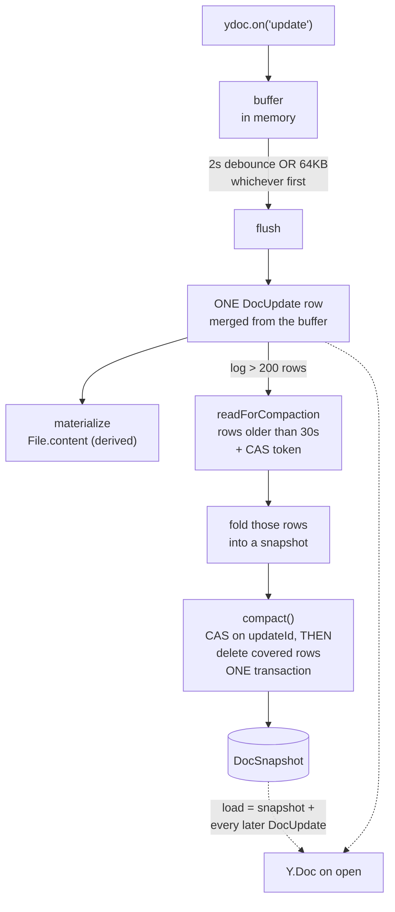
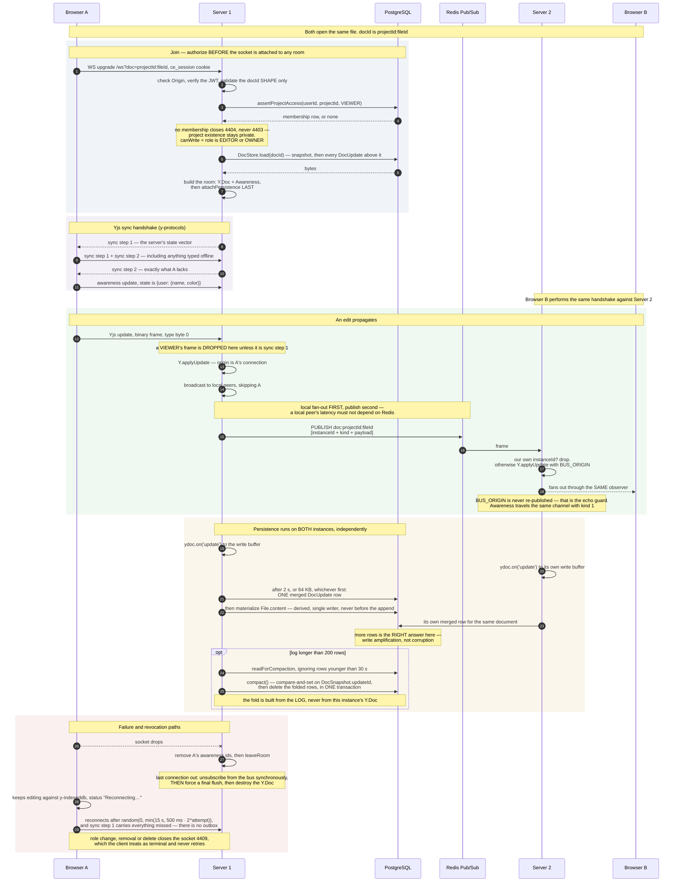

# Real-time collaboration

Multiple authenticated users edit the same file at the same time, with live cursors. Edits
survive a refresh, a disconnection, an offline period and a server restart, and converge across
two server instances.

This document is precise about one thing above all: **what Yjs does versus what this project
had to build.** Code execution is a separate mechanism and is documented in
[EXECUTION.md](EXECUTION.md).

**Source of truth:** `apps/server/src/modules/{collab,persistence,redis}`,
`packages/shared/src/protocol.ts`, `apps/web/src/features/collab`. Read on **2026-09-03**.

---

## 1. Yjs versus this application

**This project did not implement a CRDT.** Conflict-free merging is Yjs's, and no line of it
was written here.

| Provided by Yjs and its ecosystem | Built by this project |
|---|---|
| The CRDT itself — `Y.Doc`, `Y.Text`, conflict-free merge of concurrent edits | The WebSocket **server** that speaks the protocol, and the client provider that speaks it back |
| The binary update format, `Y.encodeStateAsUpdate`, `Y.applyUpdate`, `Y.mergeUpdates`, `Y.encodeStateVector` | **Authentication** on the upgrade, and **per-document authorization** at join |
| `y-protocols/sync` — the step 1 / step 2 / update exchange | The **frame envelope** (one type byte) and the **application close codes** |
| `y-protocols/awareness` — the presence message format and its client-id bookkeeping | Relaying awareness, and **tying client ids to sockets** so a caret disappears on disconnect rather than on timeout |
| `y-indexeddb` — local browser persistence | The **`ready` gate** deciding when a document is safe to mount |
| `y-codemirror.next` — the editor binding and remote caret rendering | Everything below: rooms, the **`DocStore`** layer, snapshots, compaction, materialization |
| — | The **Redis doc bus** for cross-instance fan-out, and both echo guards |
| — | **Read-only enforcement** for VIEWERs, and revocation |
| — | **Reconnection**: backoff, jitter, and which close codes are terminal |

`y-websocket`'s bundled server and Hocuspocus were both rejected, because authentication,
per-document authorization, persistence and cross-instance fan-out all need a seam those hide
([ADR-001](adr/ADR-001-yjs-transport.md)).

**Where the division bites:** Yjs guarantees that peers which exchange updates converge. It
guarantees nothing about *who is allowed to be a peer*, *whether the bytes are still there
tomorrow*, or *what happens when the socket dies*. Those three are this project.

---

## 2. A document is one file

```
docId = `${projectId}:${fileId}`          e.g.  cmd7…:cmd9…
```

One `Y.Doc` per open file, holding exactly one `Y.Text` under the key `content`
(`Y_TEXT_KEY`). The same id names the WebSocket parameter, the room, the update log rows, the
Redis channel and the browser's IndexedDB database — one name for a document, not five.

`parseDocId` returns `null` rather than throwing, and **invalid input is rejected, never
repaired** — a parser that quietly fixed its input would let two peers disagree about which
room they are in.

---

## 3. Transport

```
ws://<same origin>/ws?doc=<projectId>:<fileId>
```

**Binary frames only.** Byte 0 is a varint message type (`0` Sync, `1` Awareness); the rest is
an opaque `y-protocols` payload. A text frame closes the socket. The full frame layout and the
close-code table are in [API.md](API.md) §8.

Three properties of the handshake are load-bearing:

- **The session cookie authenticates the upgrade.** No `?token=` — a token in a URL lands in
  proxy logs and `Referer` headers. `docs/PLAN.md` row 3.2 says otherwise and was deliberately
  not followed.
- **Every rejection is an application close code**, never a pre-upgrade HTTP 401, because a
  browser cannot read that status — `onclose` gives 1006 with no reason. Completing a handshake
  that is about to be closed costs a few hundred bytes and gives every rejection one shape.
- **Messages that arrive during the handshake are collected and replayed.** A client sends sync
  step 1 the instant `open` fires, while the server is still awaiting its database query, and
  `ws` drops messages with no listener attached. A lost step 1 is a document that silently
  never syncs.

`originCheck` guards mutating HTTP methods only and an upgrade is a GET, so `wsServer.ts`
checks `Origin` itself.

### The dev proxy is part of this

The cookie is `httpOnly; SameSite=Strict`. Vite on `:5173` and the API on `:4000` are different
origins, so without the proxy the browser accepts the login cookie and never sends it again.
`vite.config.ts` proxies `/api` and `/ws` (with `ws: true`, which forwards the upgrade rather
than answering it). The browser then sees one origin, `Origin` stays `http://localhost:5173`,
and the cookie reaches `:4000` on the handshake.

---

## 4. Authorization

**Authorization runs once, at join, before the socket is attached to a room** — a membership
check per keystroke would be a database read per keystroke.

```
assertProjectAccess(userId, projectId, 'VIEWER')   ← the same function the REST layer uses
conn.canWrite = hasRole(role, 'EDITOR')
```

- **Knowing a `docId` is not enough.** A non-member is closed **4404** — identical to "no such
  file", so project existence stays private.
- The `projectId` half of the id is never trusted alone: the room query is
  `findFirst({ where: { id: fileId, projectId } })`, so a file id from another project does not
  resolve.
- **A VIEWER is admitted read-only.** Any Sync frame that is not sync step 1 is dropped
  server-side. The disabled editor in the UI is a courtesy; this is the control.

What makes "authorize once" safe is that a role change, a removal, a project delete and a file
delete all **close the affected sockets with 4409**, from hooks the services call after the
database change commits. Never add a per-message check or a timer.

> **This does not cross instances.** Those hooks walk *this process's* rooms. With two
> instances, a demoted user keeps a live socket on the other one until they disconnect. See
> §10.

---

## 5. Rooms

A room is a `Y.Doc`, an `Awareness`, a set of connections and a write buffer. Created when the
first connection joins, destroyed when the last leaves.

Four details are the difference between working and subtly broken:

1. **`rooms` is a `Map<docId, Promise<Room>>` and the promise is inserted synchronously.**
   Seeding awaits Prisma; a second socket arriving during that await must join the *same*
   promise. Two racers creating two rooms shows up as the file's text appearing twice.
2. **`conns.size` *is* the reference count.** There is no second counter to drift from it, and a
   room is destroyed only from `leaveRoom`.
3. **`conns.size === 1` is not "I am the first".** `joinRoom` adds inside the async function, so
   two sockets joining a cold room can both see 2 — leaving the room with no observers and no
   fan-out at all. The fan-out observers are guarded by a `room.observed` flag instead, with no
   await between check and set.
4. **`pendingWrites` serializes a rejoin against an in-flight final append.** Pressing F5 during
   the last write would otherwise build a room missing those edits for the rest of the session.

**Seeding.** The first time a document is opened, `File.content` is the only text that exists;
it is inserted and then **persisted immediately as the initial snapshot**, before anything can
be typed. Without that, the next open finds nothing stored, re-seeds from `File.content` and
replays the log on top — text appearing twice again.

**`attachPersistence` is attached LAST**, after loading and seeding. `Y.applyUpdate` fires
`ydoc.on('update')`, so attaching earlier appends every update just read out of the log straight
back into it: the log doubles on every open while the room looks perfectly correct. One test —
*"does not grow the log when a document is reopened"* in `rooms.test.ts` — is what catches this.

---

## 6. Awareness and presence

Each client publishes `{ user: { name, color } }` via `awareness.setLocalState`. **Nested under
`user`** because that is the field `y-codemirror.next` reads to label and colour a remote caret;
a flat `{name, color}` renders every caret as "Anonymous" in the default blue.

The server **relays awareness and never interprets it**. It calls `awareness.setLocalState(null)`
on the room's own Awareness, because a fresh `Awareness` gives itself an empty local state that
would otherwise be relayed to everyone as a phantom cursor belonging to the server.

Each connection records the awareness client ids it owns, so `removeAwarenessStates` can drop
its caret **the instant the socket closes** rather than when awareness times out. Ids arriving
from another instance are deliberately *not* filed under a local socket — they belong to a
socket over there, and only that instance may remove them.

The client's `Facepile` reads awareness through `useSyncExternalStore`. Two things are
load-bearing: filter out your own `clientID`, and **memoise the snapshot** — `getStates()`
returns a new `Map` on every call, so an uncached snapshot re-renders forever.

---

## 7. Persistence

```
load    = latest DocSnapshot + every DocUpdate with a greater id, in id order
write   = ydoc.on('update') → buffer → ONE merged row per flush
flush   = 2 s debounce OR 64 KB, whichever first
          forced on the last disconnect, on shutdown, and before every code run
compact = > 200 rows → fold the log → snapshot + delete, one transaction,
          behind a compare-and-set, never folding a row younger than 30 s
```

Constants, all real: `FLUSH_DELAY_MS = 2_000`, `FLUSH_BYTES = 64 * 1024`,
`COMPACT_AFTER = 200`, `COMPACT_LAG_MS = 30_000`.



### Timing, precisely

- The debounce is **not restarted per update**. A debounce that reset on every keystroke would
  never fire while someone is actually typing. The first update after a flush starts the clock;
  the write happens 2 s later.
- **A hard kill costs at most ~2 seconds of typing** — the debounce, and a deliberate trade
  against a database write per keystroke. Recorded as verified end to end with `pkill -9`,
  restart, reload, text intact (`docs/plans/summary4.md`).
- Flushes are **chained**, so two cannot interleave and land their rows out of order.

### Rules

- **Yjs binary updates are persisted, never plain text.** Rebuilding a `Y.Doc` from a string
  gives its items new client ids, so restored peers merge as duplicates rather than converging.
- **`File.content` is derived state with exactly one writer**, written after the append that
  produced it. It may lag the log by one flush and must never lead it. A failed materialization
  is logged and dropped. Compaction never writes it. See [DATABASE.md](DATABASE.md) §6.
- **An append failure re-buffers rather than dropping edits** — the merged update goes back to
  the front of the buffer and the next flush retries. The forced flush at eviction is the last
  chance; if that fails it is logged.
- **`persistence` imports nothing from `collab`.** It takes ids and a `Y.Doc`, never a `Room`.
- **A `DocStore` implementation may not import `yjs`.** Storage stays byte-opaque, which is what
  keeps it swappable at one line.

### Compaction, and why it is subtle

- **`compact()` is one store method, not `writeSnapshot` + a delete.** A crash between them in
  the wrong order is data loss; in the right order it is a no-op, because Yjs applying an
  already-folded update does nothing.
- **It reads the log, never the live `Y.Doc`.** Since two instances append to the same log and
  the doc bus is at-most-once, a row can exist in the database having never reached this
  process. Folding this instance's document and deleting that row would destroy it permanently.
  The bytes folded are exactly the bytes about to be deleted, so the snapshot covers them
  whoever wrote them.
- **The fold uses a throwaway `Y.Doc`, not `Y.mergeUpdates`.** Merging concatenates payloads
  without collecting deleted content, so the snapshot would grow with the document's *history*
  rather than its size.
- **No row younger than 30 s is ever folded.** `DocUpdate.id` is allocated before its
  transaction commits, so a lower id can surface after compaction has read past it — it would
  survive the delete and then be hidden forever by `load`'s tail filter. It is a margin, not a
  proof.
- **The write is a compare-and-set on `DocSnapshot.updateId`, and the delete runs only after
  the CAS wins.** A `false` return guarantees nothing was written *and* nothing deleted.

→ [ADR-002](adr/ADR-002-persistence-op-log.md) · `docs/notes/compaction.md` ·
`docs/notes/persistence.md`

---

## 8. Multiple server instances

One Redis channel per document, `doc:<projectId>:<fileId>`. Frame:

```
┌──────────────────┬────────────┬─────────────────────────┐
│ instanceId (str) │ kind (var) │ payload (varUint8Array) │   lib0-encoded
└──────────────────┴────────────┴─────────────────────────┘
   kind: 0 Sync · 1 Awareness
```

**Local fan-out happens first, the publish second.** A local peer's latency must never depend on
Redis.

**Two echo guards, and both are needed.** Redis delivers our own publishes back to our own
subscriber, so `instanceId` is checked on receive before anything else; and a frame applied from
the bus carries a private `BUS_ORIGIN` sentinel that the observers refuse to re-publish. They
fail in different directions.

**A remote frame is applied and then fans out through the *same* observer.** That is why there
is no separate "send this remote update to my sockets" branch. It is also why `isConnection` is
false for bus frames, which keeps a remote peer's awareness ids off local sockets.

**`unsubscribeDoc` runs synchronously in `leaveRoom`, immediately after `rooms.delete` and
*before* the final flush is awaited.** That await can take a while; a rejoin inside it builds a
fresh room subscribing to the same channel, and unsubscribing afterwards would tear down the
*new* subscription — the document would then silently stop receiving remote edits for the rest
of its life.

**Delivery is at-most-once, by design** ([ADR-003](adr/ADR-003-multi-instance-pubsub.md)):
durability is Postgres's job and gap repair is Yjs's. Redis Streams were rejected for that
reason. Both connections are lazy, so importing the module connects to nothing and `buildApp()`
stays Redis-free.

> **"Gap repair is Yjs's" is true only across a re-sync — be precise about this.** Yjs repairs a
> gap on the next sync step 1 / step 2 exchange, which happens when a client **connects or
> reconnects**. While both sockets stay open, no further sync round-trip occurs, so **a dropped
> bus frame is not repaired** — the two instances simply diverge until someone reconnects. The
> `Y.Doc`s are not exchanging state vectors continuously.
>
> **Observed once, on 2026-09-03.** Under load — immediately after 24 run enqueues and 101 file
> creations on the same event loop — one instance's first edit never reached the other (>5 s),
> the documents did not converge, and the materialized `File.content` kept only the second
> instance's text. **It did not reproduce**: three subsequent trials on quiet servers propagated
> in ~41 ms and converged every time.
>
> The likely mechanism is visible in `docBus.ts`: `subscribeDoc` calls
> `getSubscriber().subscribe(channel).catch(…)` and **does not await the acknowledgement**, while
> `attachRoomObservers` returns immediately. That leaves a window in which the room can already
> fan out local edits but Redis has not yet registered the subscription — and at-most-once means
> anything published in that window is gone. Awaiting the subscription would narrow the window;
> it would not close the general case, which is inherent to Pub/Sub.

**Phase 7 added no reconnect logic.** ioredis retries the bus; the browser retries itself. A
third reconnect system would be the sign something went wrong.

### The full path

Source: [`documentation/diagrams/03-realtime-collaboration.mmd`](../documentation/diagrams/03-realtime-collaboration.mmd).



### Write amplification is expected

Two instances holding the same document each have their own `Y.Doc`, buffer and flush cycle, so
they write **more `DocUpdate` rows** than one would. Yjs converges and the text is correct. The
Phase 8 harness measured the ratio at **2.0×** in both the hot-doc and the distributed scenario
(`docs/notes/loadtest-results.md` §6). **Never assert row counts as a correctness check.**

---

## 9. Offline and reconnection — client only

No server code participates. Yjs makes this possible; the policy is this project's.

```
local  = y-indexeddb per open doc, database name = the docId
mount  = provider.ready  (local store OR first server sync, whichever answers first)
retry  = random(0, min(15 s, 500 ms · 2^attempt)) on a non-terminal close
stop   = 4400 · 4401 · 4403 · 4404 · 4409 — terminal, never retried
labels = Live · Reconnecting… · Offline · Disconnected   (Read only wins over all)
```

- **`ready` and `status` are different questions.** `ready` = "there is a document"; `status` =
  "there is a connection". Offline with a local copy is `ready: true` — the editor mounts and is
  typeable, which *is* the point. Collapsing them makes the editor refuse to mount without a
  server.
- **`ready` requires `whenSynced` AND `Y.encodeStateVector(ydoc).byteLength > 1`.** `whenSynced`
  resolves for an *empty* database too, and mounting on that alone flashes an empty editor you
  can type into before the server answers. A fresh `Y.Doc` encodes one byte; anything restored
  is longer — which is also correct for a document whose text is now `""`, since it still has
  items.
- **There is no offline outbox and there must never be one.** Updates made while the socket is
  down stay in the `Y.Doc`; `send()` no-ops unless the socket is OPEN; **sync step 1 on
  reconnect tells the server exactly what it missed**, and the server's buffer then persists
  those replayed updates as if they had been typed live.
- **A reconnect replaces the socket and only the socket.** The `Y.Doc`, `Y.Text`, `Awareness`
  and the mounted `EditorState` survive — recreating the document would lose the cursor and undo
  history on every blink, and hand it new client ids.
- **The backoff resets on a successful *sync*, never on `open`.** A server that accepts the
  upgrade and immediately closes would otherwise reset the delay on every attempt — a tight loop
  wearing a friendly name.
- **Awareness is re-published on open.** The room dropped our presence when the socket died;
  without this a reconnected user has live text and no caret.
- **`navigator.onLine` labels the connection and nothing else.** Only its `false` direction is
  trusted — a captive portal just leaves the label at "Reconnecting…".

---

## 10. Failure paths

| Failure | Behaviour |
|---|---|
| Malformed frame, text frame, unknown message type | That one socket closes **4400**; the process is unaffected |
| `Origin` present and not `WEB_ORIGIN` on the upgrade | Closes **4400** before authentication is even attempted. A *missing* `Origin` is allowed through — verified 2026-09-03 |
| VIEWER sends a write | Dropped server-side with a log line; the socket stays open. **The VIEWER's own `Y.Doc` keeps the rejected text** until they reload — their local copy silently diverges from the server's, with no signal beyond the read-only badge. Verified 2026-09-03 |
| A doc-bus frame is dropped | Not repaired while both sockets stay open — see §8. Repaired on the next reconnect |
| Append to the log fails | Re-buffered at the front and retried next flush; eviction's forced flush is the last chance |
| `materializeContent` fails | Logged and dropped — never rolled back, never requeued |
| Compaction fails, or loses its CAS | Logged / returns `false`. Nothing written, nothing deleted; the log is merely longer |
| Bad or late frame on the doc bus | Decoded to `null` or caught and logged; never fatal |
| Redis unreachable | ioredis retries. Publishes are fire-and-forget. **Collaboration between instances stops**; within one instance it is unaffected, and Yjs repairs the gap on the next sync |
| Postgres unreachable | `load` throws and the document **refuses to open** rather than silently starting empty — an empty editor over a document with content reads as "my work is gone", and once you type, that emptiness becomes real |
| Socket drops | Client shows *Reconnecting…*, keeps editing locally, retries with jittered backoff |
| Server restart | Up to ~2 s of unflushed typing lost; clients reconnect and re-sync |
| Role change / removal / delete while connected | Socket closed **4409**, treated as terminal by the client — no retry loop |
| File deleted while open | Room closed 4409, document rows deleted. A final flush can land just after, leaving unreachable orphan rows |
| Tab closed mid-write | The last IndexedDB write may be lost — `destroy()` runs in a React cleanup and cannot await. **The server already has those updates**; only the local mirror can lag |

---

## 11. Measured behaviour

All numbers below come from the Phase 8 harness on **2026-08-15**, git
`09b4c3f`, on a 4-core WSL2 VM with 6 GB. Full method, environment and raw blobs:
`docs/notes/loadtest-results.md` and `loadtest/results/`. **They were not re-measured for this
document.**

At **25 clients**, edit-propagation latency (marker seen by a peer):

| Scenario | Topology | p50 | p95 | p99 | Converged |
|---|---|---|---|---|---|
| Hot doc (1 document) | 1 instance | 5 ms | 10–11 ms | 13 ms | yes |
| Hot doc (1 document) | 2 instances | 5–6 ms | 11–13 ms | 15–18 ms | yes |
| Distributed (9–10 documents) | 1 instance | 2 ms | 4–5 ms | 8–11 ms | yes |
| Distributed (9–10 documents) | 2 instances | 2–3 ms | 4–8 ms | 9–14 ms | yes |

**Capacity was not measured and cannot be, on that machine.** The load generator shares four
cores with both servers, Postgres and Redis, and **saturates first** — at 100–200 clients it used
402–403% of a 400% budget while server CPU never exceeded 32% of one core. The published numbers
describe propagation latency, not how many users the system supports. Above ~100 clients the
harness's fixed 2 s settle window is shorter than p99 propagation, so **convergence becomes
unconfirmable** — a harness limitation, with no errors and no dropped clients in those runs.

**Persistence write rate** was measured from outside: the 2 s debounce shows up as roughly
**30 `DocUpdate` rows per document per minute per instance**. **Flush latency and log length
are not instrumented at all**, and compaction has been observed once under load (Phase 11) but
never profiled.

---

## 12. Known limitations

- **Revocation does not cross instances.** The 4409 hooks walk this process's rooms only. A
  demoted or removed user keeps a live socket on the other instance until they disconnect. They
  cannot re-enter or reach anything new — authorization runs at every join and every REST call —
  but an open editor stays open. The fix is a revocation channel on the same bus.
- **`pendingWrites` is per-process**, so an F5 landing on the other instance does not wait on an
  in-flight append there.
- **A never-opened document could be seeded twice** if two instances cold-open it simultaneously
  — the "text appears twice" mode. Needs a genuinely simultaneous first open; fixable with an
  advisory lock, unfixed and recorded.
- **`INSTANCE_ID` is per process, not per deployment.** Two instances pointed at one Redis
  exchange frames even across different databases.
- **No rate limit, message-size cap or connection cap on `/ws`** — and clients now retry on
  their own. The terminal close codes and the capped jittered backoff are the only things
  stopping a storm at the source.
- **Local IndexedDB is never cleared, and revocation does not reach it.** A VIEWER who opened a
  file keeps a readable offline copy indefinitely after removal, and two accounts on one browser
  profile share those databases.
- **No background compaction sweep**, and 200 rows is a constant, not configuration. A document
  nobody writes never compacts — which is fine, because it never grows either.
- **Orphan document rows are possible on delete** (§10).
- **The client's 4403 handling is verified only against a fake socket**, because the server
  branch that sends it is unreachable while VIEWER is the floor.
- Deferred client defects: renaming a folder leaves descendants' open tabs showing the old path;
  stale expanded-folder paths accumulate; scroll is not preserved across tab switches. None
  risks data.

---

## 13. Verification status

**Automated.** 245 server tests passed on 2026-09-03. Directly relevant: `collab.test.ts` (25 —
handshake, sync, awareness, authorization, revocation), `rooms.test.ts` (26 — registry, load and
flush, the log-growth regression), `docStore.test.ts` (21), `compaction.test.ts` (3 — including
the racing-compactor CAS), `protocol.test.ts` (22), `docBus.test.ts` (9).

**Recorded manual verification** (Phase 7, `docs/notes/scaling.md`): two browser profiles, two
accounts, two server instances — convergence and awareness both ways, simultaneous same-offset
typing, no duplication, caret removal across instances. One caveat recorded there: the
instance-restart step is operator-reported rather than observed.

**Protocol-level runtime verification, 2026-09-03 (`[run]`).** The collaboration protocol was
driven headlessly with a real `ws` + `yjs` client against a fresh build. Observed: **4401** for
absent and invalid cookies; **4400** for a malformed `?doc` and for a mismatched `Origin`, while
a *missing* `Origin` is admitted; **4404** for a non-member, an unknown file, a **cross-project
file id** and a **directory**; a VIEWER's write **dropped server-side**; **4409** on removal with
a **4404** on rejoin; type → 2 s flush → `File.content` matching exactly; a cold reopen with **no
duplication**; two clients converging on one instance; and **cross-instance propagation in
~41 ms** with both sides converged. Full evidence:
[`documentation/03-final-audit.md`](../documentation/03-final-audit.md) §2.5–2.10.

**UNVERIFIED — MANUAL CHECK REQUIRED: everything above the protocol.** No browser has ever been
driven in this project's documentation work. The offline path in particular is **entirely
client-side and therefore entirely click-through-verified** — there are no frontend tests at all,
and the rendering of remote carets, the status line and the facepile has never been observed. To
confirm it yourself:

1. Open a project file in two browser profiles as two accounts; type in both. Expect live carets
   and convergence.
2. DevTools → Network → **Offline**. Keep typing. Expect the status line to read *Reconnecting…*
   while the editor stays usable.
3. Go back online. Expect both tabs to converge with no duplicated text and the caret to return.
4. `Ctrl-C` the server, restart it, reload. Expect the text intact.
5. With two instances (`dev:server` + `dev:server:b`), open the same file on both and repeat 1.

Report what you see and it can be recorded here as verified.
